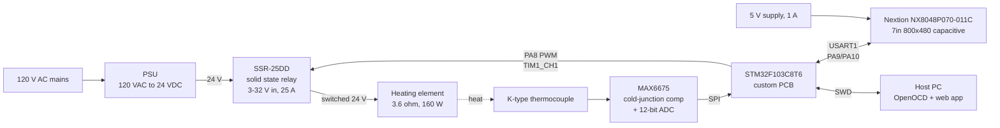

# Reflow Oven Controller

A toaster oven converted into a PCB reflow oven, driven by a custom
STM32F103 board with a K-type thermocouple, a solid state relay and a 7"
Nextion touch panel.

The firmware runs a PI loop on the MCU. A host can steer it either from a
small web app over SWD (working today) or from the Nextion panel
(in progress).

---

## System



### Bill of the major pieces

| Part | Detail | Notes |
|---|---|---|
| **MCU** | STM32F103C8T6 | Custom PCB, OSHPark. 64 MHz from **HSI** - the 8 MHz crystal Y1 is not populated |
| **Temperature** | K-type thermocouple to MAX6675 | SPI, 0.25 °C resolution, 220 ms conversion. Terminal block J5 |
| **Heater switch** | SSR-25DD | DC-DC, 3-32 V control, 5-200 V DC out, 25 A. Driven from PA8 |
| **Heating element** | 3.6 Ω at 24 V | 6.7 A, **160 W**. Hugely oversized for bench setpoints - see `skill.md` |
| **Power** | 120 VAC to 24 VDC | Feeds the element through the SSR |
| **Display** | Nextion NX8048P070-011C | 7", 800x480, capacitive, *Intelligent* series. **Needs its own 5 V at 1 A** - no USB power |
| **Debug** | ST-Link V2 on J2 | 3V3 / SWDIO / SWCLK / GND only. **No NRST** |

### Pin map

| Signal | MCU pin | Net / test point |
|---|---|---|
| MAX6675 `~CS` | PA4 | `Thermo_CS`, TP2, indicator D4 |
| MAX6675 `SCK` | PA5 | `Thermo_SCK`, TP3 |
| MAX6675 `SO` | PA6 | `Thermo_SO`, TP4 |
| SSR control | PA8 | `Relay`, J6, TIM1_CH1, indicator D3 |
| USART1 TX -> Nextion RX | PA9 | TP6 |
| USART1 RX <- Nextion TX | PA10 | TP5 (5 V tolerant) |
| SWD | PA13 / PA14 | J2 |

Two board quirks worth knowing before wiring anything:

- **J4 (the 5 V serial header) does not work.** Its BSS138 level shifters are
  rotated one pin position, so a signal arriving there reaches only a MOSFET
  gate - there is no DC path to the MCU. Go directly to **PA9 / PA10**
  (TP6 / TP5). No level shifting is needed in either direction.
- **SW1 selects BOOT0.** In the +3.3 V position the part boots from SRAM and
  never runs your firmware. It belongs in the **GND** position.

---

## Repository layout

```
Hardware/
  KiCad/            schematic, PCB, gerbers, BOM, 3D step
Software/
  webapp/           browser UI + Python bridge (bridge.py, index.html)
  run_webapp.ps1    build, flash, serve the web app
  run_profile.ps1   open-loop step tests, PI profiles, hardware probes
  run_monitor.ps1   plain thermocouple monitor
  Display/          Nextion HMI designs
  Embedded/
    Thermo_Monitor/ the live firmware (all current work)
    Reflow_Oven_STM32_SOURCE_V1_1/  original 2021 firmware, Nextion HMI
    Reflow_Oven_STM32_Source/       earlier revision
skill.md            project goal, architecture and the pitfalls found so far
```

---

## Quick start

Everything is driven from `Software/`, with the ST-Link connected. The
STM32CubeIDE toolchain is used in place, so nothing extra needs installing;
`make` comes from Git Bash.

```powershell
# live temperature only
.\run_monitor.ps1 -Seconds 30

# browser UI: setpoint + Kp/Ki in, temperature and duty out
.\run_webapp.ps1 -Kp 0.2 -Ki 0.002 -MaxDuty 1.5
# then open http://127.0.0.1:8770/

# open-loop step test, for characterising the plant
.\run_profile.ps1 -Mode step -PwmHz 1 -StepDuty 10 -BaseSeconds 180 -Seconds 500 -Csv step.csv
```

The firmware builds in several modes, selected at compile time:

| `MODE=` | What it does |
|---|---|
| *(none)* | thermocouple monitor, no heating |
| `pi` | fixed 30/40/50 °C profile with dwells |
| `step` | open-loop step at a fixed duty, for plant characterisation |
| `hold` | park the output at a duty so the driver can be probed |
| `server` | PI loop steered from the host over SWD - used by the web app |
| `nextion` | **PI loop driven from the Nextion panel** - Start/Stop arm it, Apply sets setpoint and gains, telemetry goes back to the screen |
| `hmi` | Nextion first-contact probe - baud sweep, pin checks, frame dump |
| `tx` / `rx` | continuous transmit / raw receive capture, for tracing wiring |

---

## Status

**Working:** thermocouple readings, SSR drive, PWM on TIM1_CH1, PI loop on
the MCU, web app with live charts and a dead-man switch, all the safety
cutoffs.

**Working on the panel:** wire it **straight to PA9 / PA10** - not J4, whose
level shifters are miswired. `MODE=nextion` is a full controller driven from
the screen: Start and Stop arm and disarm the loop, Apply sets the setpoint
and gains, and the firmware pushes temperature, setpoint, duty, error, state,
the status LED, the P/I split and the trend waveform back to the panel. The
object map is `Software/Display/README.txt`.

**Remaining on the panel:** a run on real hardware to confirm the arming path
end to end. Note the trend waveform's `add` command takes a single byte, so
the trace clips above about 91 °C - fine for bench work, not for a reflow
profile.

**Not started:** reflow profiles proper (soak / ramp / peak / cool),
enclosure, mains-side safety.

See `skill.md` for the detail, and especially for the things that cost real
time to discover.
